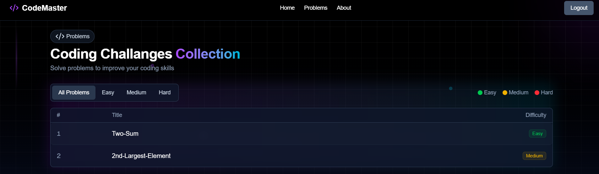

# 🧮 Algorithmic

Algorithmic is a coding practice platform that enables users to **sign up, log in, browse programming challenges, and submit solutions**. It evaluates submissions in **real-time** using an integrated code execution engine (**Judge0**), providing instant feedback on correctness and efficiency.  

Built for performance and scalability, Algorithmic uses modern full-stack technologies to deliver a smooth, responsive, and interactive experience for competitive programmers and learners.

----

## 🚀 Features
- **User Authentication** – Sign up, log in, and manage your profile
- **Browse Challenges** – Explore a variety of programming problems
- **Code Execution Engine** – Judge0 integration for real-time evaluation
- **Instant Feedback** – See results on correctness and performance
- **Multiple Language Support** – Write and test solutions in different programming languages
- **Scalable Backend** – Optimized for handling large numbers of submissions

---

## 🛠 Tech Stack
- **Project:** Next.js, Tailwind CSS, TypeScript   
- **Database:** PostgreSQL + Prisma ORM  
- **Code Execution:** Judge0 API  
- ** WebHooks (for catching results)  

---

## 📦 Installation & Setup

```bash
# Clone the repository
git clone https://github.com/yourusername/algorithmic.git
cd algorithmic

# Install dependencies 
npm install

# Set up environment variables for backend
# Create a .env file inside backend folder and add:
# PORT=4000
# DATABASE_URL=your_postgres_connection
# JUDGE0_API_URL=https://api.judge0.com
# JUDGE0_API_KEY=your_api_key

# Start Project
 npm run dev


```

# 📸 Screenshots

### Signin Page


### Landing Page


### Questions Page


### Workspace Page


